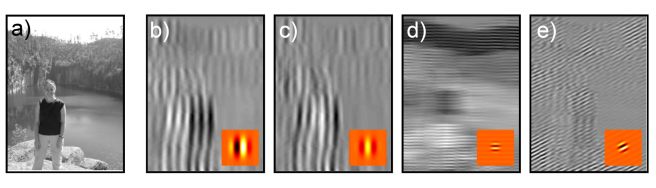
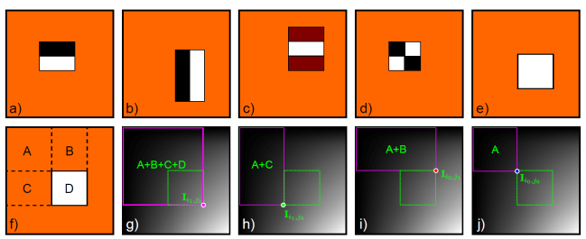
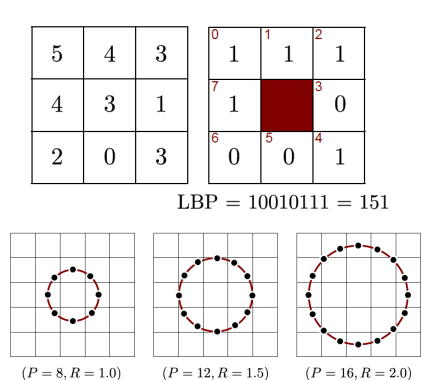
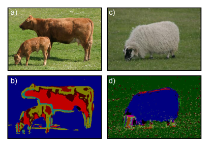
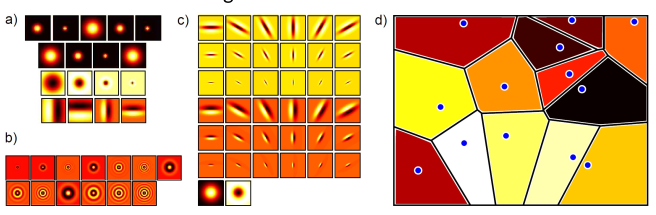
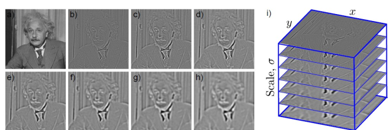

# Computer Vision: Models, Learning and Inference
> Chapter 13
## Image Preprocessing and Feature Extraction

* Try to reduce unwanted variation in image due to lighting, scale, deformation etc
* To reduce data to a manageable size
* Give the subsequent model a chance
* Preprocessing definition: deterministic transformation of pixels $p$ to create data vector $x$
* Usually heuristic based on experience

## Normalisation
* Fix first and second moments to standard values
* Remove contrast and constant additive luminance variations

## Histogram Equalisation
* Make all of the moments the same by forcing the histogram of intensities to be the same. 

## Convolution
* Takes pixel image $p$ and applies a filter $f$ 
$$
x_{i j}=\sum_{m=-M}^{M} \sum_{n=-N}^{N} p_{i-m, j-n} f_{m, n}
$$
* Computes weighted sum of pixels values, where weights given by filter
  * Negative is Convolution
  * Positive is Correlation

* Blurring
* Gradient Filter

  * The vertical Prewitt filter is called vertical because the gradient is vertical. 

* Gabor Filters

$$
f_{m n}=\frac{1}{2 \pi \sigma^{2}} \exp \left[-\frac{m^{2}+n^{2}}{2 \sigma^{2}}\right] \sin \left[\frac{2 \pi(\cos [\omega] m+\sin [\omega] n)}{\lambda}+\phi\right]
$$
  * Gaussian Component - $\exp \left[-\frac{m^{2}+n^{2}}{2 \sigma^{2}}\right]$
  * They detect orientation in some direction
  * Detect edges at different scales and different orientation
  * Biologically inspired
  * You would use this to get the frequency and magnitude of an edge at a point in the image
  * We are in the spatial domain, but its capturing frequency domain info
* Haar Filters
  * Haar Wavelet approximation
  * Convolutions with different number of wavelengths
  * Incredibly fast to evaluate, because we can take the filter and place it on the image, there will be one region where the value is 1 and another where there are -1. 
  * Can apply them really really efficient
  * To calculate is constant time, compared to $n^2$ for convolution
  * The integral is $n$ operations where $n$ is the number of pixels
  * Dynamic Programming is how you might need 
  * Viola-Jones
    * Adaboost
      * Adaptive Boosting
      * Cascade - use the weak classifiers to build one strong classifier
    * A haar-feature at a specific position and scale is a weak classifier
      * Shadow under your eyes
      * Bright bar on your nose shadow on either side
      * Forehead bright
    * When something is no a feature throw it away quickly
    * Can we build a degenerate decision tree
    * Really good recall but not the best precision is what we want
    * State of the art for object detection for quite a while

* Local Binary Patterns
  * A way to find local features
  * Gets us a number between 0 and 255 using the LBP from checking the max of each neighbour.
  * Capturing that kind of information is really useful
  * Can rotate the binary pattern one bit to the left, in an attempt to keep the smaller number (which is what we want)
  * The bitshifting makes it invariant to where you start reading off the binary number. It cuts down on the number of binary patterns you can get
  * Gives us an invariance that allows us better control of what we have. (??)
  * The squares only look at the 8 neighbouring pixels

* The circles at the bottom allow us to surround the pixel we care about, how many numbers do we want to measure off of that circle. 
* You would do a bilinear interpolation to get a value for the pixels where the dots are. 
* works the same as the convolution
## Textons
* An attempt to characterize texture
* Replace each pixel with a integer representing the texture `type`
* Basically K-Means

* Take a bank of filters and apply to lots of images
* Cluster in filter space
* For a new pixel surrounding region with the same bank, and assign to nearest cluster

## Edges
## Canny Edge Detector
* Non-maximal suppression
  * If it is the maximum compare to its two neighbours we keep it
  * Allows us to get much cleaner and fine tuned edges

* Hysteresis Thresholding
  * If an edge is next to another we keep it on account of it being an OG. 
  * If its in the middle it might be an edge 
  * When we know there is a main edge look around it and try to find maybe edges, then just make them real edges - you can then ignore any edges that are not attached to any main edges. 
## Corners
## Harris Corner Detector
* Make decision based on image structure tensor
* Homography is the same projection

## Sift Detector
* Find extrema n this 3D volume

* Assign Orientation
  * Orientation assigned by looking at intensity gradients in region around point
  * Form a histogram of these gradients by binning
  * Set orientation to peak of histogram