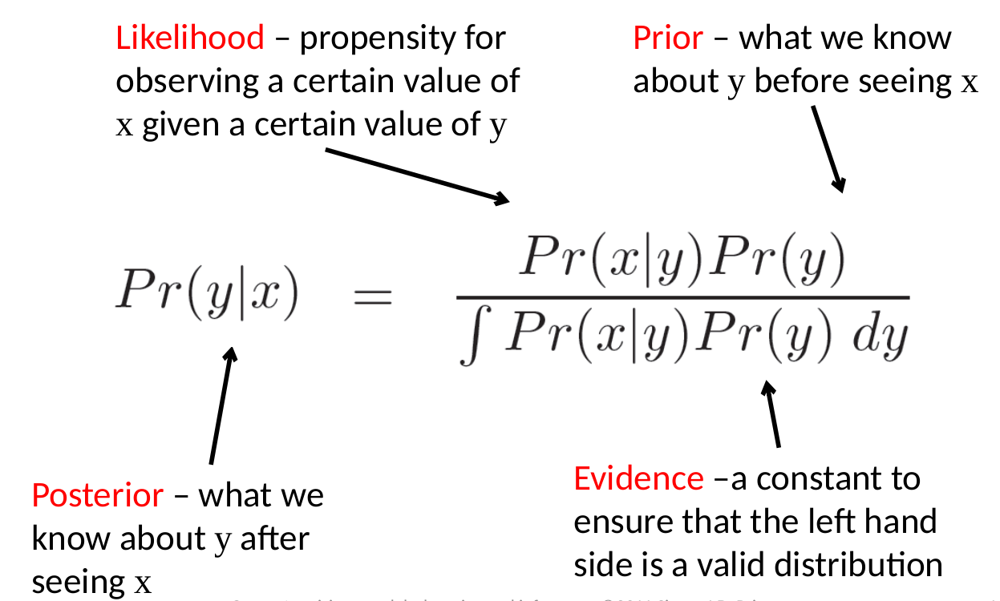

# Computer Vision: Models, learning and inference

# Bayes Rule

# Expectation
Expectation tell us the expected or average value of some function $f[x]$ taking into account the distribution of x 

$$
\begin{aligned} \mathrm{E}[f[x]] &=\sum_{x} f[x] \operatorname{Pr}(x) \\ \mathrm{E}[f[x]] &=\int f[x] \operatorname{Pr}(x) d x \end{aligned}
$$