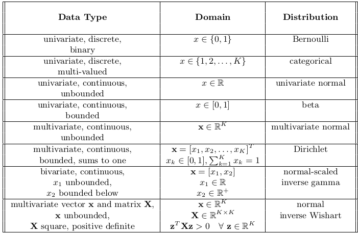

# Computer Vision: models, learning and inference
* Read through Chapter 1, 2 and 3 up to Conjugancy

Complete the following questions:
Chapter 2: 1,2,3,4,6,7,8,9,10 - everything except 5
Chapter 3: 1,2,3,6,8,9,10,11 - 4 if you feel like it, 12 will make you sad

# Chapter 1
Introduction, not that important.

* The goal of computer vision is to extract useful information from images. 

Here is the textbook structure:

* Almost all models for computer vision can be interpreted in a probabilistic context.
* Why is probability a suitable language to describe CV problems?
  * The 3D world is projected onto a 2D set of measurements. However, it is not exact and there is noise. This noise must be described, and probability is used for that.
  * The relationship between world and measurements is generally many to one: there are many real-world configurations that are compatible with the same measurements. The chance that each of these possible worlds is present can also be described using probability.

# Chapter 2
Introduction to probability

## Random Variables
* Random variable $x$ denotes a quantity that is uncertain.

# Chapter 2 Problems
1. Give a real-world example of a joint distribution $Pr(x,y)$ where $x$ is discrete and $y$ is continuous. 

$x$ shoesize, $y$ is footsize

2. What remains if I marginalize a joint distribution $Pr(v, w, x, y, z)$ over five variables with respect to variables $w$ and $y$? What remains if I marginalize the resulting distribution with respect to $v$?

$$
\operatorname{Pr}(v,x,z)=\int \operatorname{Pr}(v,w,x,y,z) dw dy
$$

$$
\operatorname{Pr}(x,z)=\int \operatorname{Pr}(v,x,z) dv
$$

3. Show that the following relation is true:

$$
\operatorname{Pr}(w, x, y, z)=\operatorname{Pr}(x, y) \operatorname{Pr}(z | w, x, y) \operatorname{Pr}(w | x, y)
$$
$$RHS = \operatorname{Pr}(x, y) \cdot \operatorname{Pr}(w | x, y) \cdot \operatorname{Pr}(z | w, x, y) \\
= \operatorname{Pr}(x, y, w) \cdot \operatorname{Pr}(z | w, x, y) \\
= \operatorname{Pr}(w, x, y, z) \\
\therefore RHS = LHS $$

4. In my pocket there are two coins. Coin 1 is unbiased, so the likelihood $Pr(h = 1|c = 1)$ of getting heads is 0.5 and the likelihood $Pr(h = 0|c = 1)$ of getting tails is also 0.5. Coin 2 is biased, so the likelihood $Pr(h = 1|c = 2)$ of getting heads is 0.8 and the likelihood $Pr(h = 0|c = 2)$ of getting tails is 0.2. I reach into my pocket and draw one of the coins at random. There is an equal prior probability I might have picked either coin. I flip the coin and observe a head. Use Bayes’ rule to compute the posterior probability that I chose coin 2:
$$Pr(c=2|h=1) \\
\operatorname{Pr}(y | x)
=\frac{\operatorname{Pr}(x | y) \operatorname{Pr}(y)}{\sum \operatorname{Pr}(x | y) \operatorname{Pr}(y) d y} \\
\frac{0.8\cdot 0.5}{0.5\cdot0.5 + 0.8 \cdot 0.5} \\
=0.62$$

5. If variables $x$ and $y$ are independent and variables $x$ and $z$ are independent, does it follow that variables $y$ and $z$ are independent?

No, not necessarily. Being independent of $x$ does not mean that it is independent $y$.

6. Use equation 2.3 to show that when x and y are independent, the marginal distribution $Pr(x)$ is the same as the conditional distribution $Pr(x|y = y ∗ )$ for any $y∗$.

$$
\operatorname{Pr}\left(x | y=y^{*}\right)=\frac{\operatorname{Pr}\left(x, y=y^{*}\right)}{\int \operatorname{Pr}\left(x, y=y^{*}\right) d x}=\frac{\operatorname{Pr}\left(x, y=y^{*}\right)}{\operatorname{Pr}\left(y=y^{*}\right)} \\
Pr(x,y) = \frac{Pr(x,y)}{Pr(y)}
$$
Given independence: $Pr(x,y) = Pr(x)\cdot Pr(y)$
$$\therefore Pr(x|y) = \frac{Pr(x)Pr(y)}{Pr(y)} \\Pr(x|y) = Pr(x)$$

7. The joint probability $Pr(w, x, y, z)$ over four variables factorizes as:

$$
\operatorname{Pr}(w, x, y, z)=\operatorname{Pr}(w) \operatorname{Pr}(z | y) \operatorname{Pr}(y | x, w) \operatorname{Pr}(x)
$$

Demonstrate that $x$ is independent of $w$ by showing that $Pr(x, w) = Pr(x)Pr(w)$.

$$
\int_y\int_z\operatorname{Pr}(w, x, y, z)dydz=\int_y\int_z\operatorname{Pr}(w) \operatorname{Pr}(z | y) \operatorname{Pr}(y | x, w) \operatorname{Pr}(x)dydz \\
P(x,w) = P(x)P(w) \int_y\int_z \operatorname{Pr}(z | y) \operatorname{Pr}(y | x, w) dy dz \\
P(x,w) = P(x)P(w) \int_y\int_z P(z,y | x,w) dy dz\\
P(x,w) = P(x)P(w) \int_y\int_z \frac{\operatorname{Pr}(y, z, x, w)}{P(x,w)} dydz \text{ Marginalise out y and z}\\ 
P(x,w) = P(x)P(w) \cdot \frac{P(x,w)}{P(x,w)} \\
P(x,w) = P(x)P(w) \cdot 1 \\
P(x,w) = P(x)P(w) 
$$

8. Consider a biased die where the probabilities of rolling sides {1, 2, 3, 4, 5, 6} are `{1/12, 1/12, 1/12, 1/12, 1/6, 1/2}`, respectively. What is the expected value of the die? If I roll the die twice, what is the expected value of the sum of the two rolls?

$$ E[X]= 1\cdot 1/12 + 2 \cdot 1/12 + 3 \cdot 1/12 + 4 \cdot 1/12 + 5 \cdot 1/6 + 6 \cdot 1/2  \\ = 4.67$$

If we roll this twice, $2 \cdot 4.7 = 9.33$

But this is approximate, we need to calculate the probability of getting each value:
|x|P(x)|
|---|---|
|2|1/44|
|3|1/72|
|4|3/144|
|5|4/144|
|6|7/144|
|7|1/8|
|8|17/144|
|9|1/9|
|10|1/9|
|11|1/6|
|12|1/4|

$$E[x] = 2\cdot 1/144 + 3\cdot 1/72 + 4\cdot 3/144 + 5 \cdot 4/144 + 6\cdot 7/144 + 7 \cdot 1/8 + 8  \cdot 17/144 + 9 \cdot 1/9 + 10 \cdot 1/9 + 11 \cdot 1/6  + 12 \cdot 1/4 = 9.33$$

9. Prove the four relations for manipulating expectations

$$
\begin{aligned} \mathrm{E}[\kappa] &=\kappa \\ \mathrm{E}[\kappa f[x]] &=\kappa \mathrm{E}[f[x]] \\ \mathrm{E}[f[x]+g[x]] &=\mathrm{E}[f[x]]+\mathrm{E}[g[x]] \\ \mathrm{E}[f[x] g[y]] &=\mathrm{E}[f[x]] \mathrm{E}[g[y]], \quad \text { if } x, y \text { independent. } \end{aligned}
$$
For the last case, you will need to use the definition of independence. 

First eqn:
$$ 
\mathrm{E}[\kappa] = \kappa \\
\mathrm{E}[\kappa]  = \int \kappa* p(x)dx \\
 = \kappa \int  P(x)dx \\
 = \kappa
$$

Second eqn:
$$
\mathrm{E}[\kappa f[x]] =\kappa \mathrm{E}[f[x]] \\
\mathrm{E}[\kappa f[x]] = \int \kappa f(x) p(x) dx \\
=\kappa  \int f(x) p(x) dx \\
 = \kappa \mathrm{E}[\kappa f[x]]
$$
Third eqn:
$$
\mathrm{E}[f[x]+g[x]] = \mathrm{E}[f[x]]+\mathrm{E}[g[x]] \\
= \int f(x)g(x)dx \\
= \mathrm{E}[f[x]+g[x]] 
$$
Fourth eqn:
$$
\mathrm{E}[f[x] g[y]] =\mathrm{E}[f[x]] \mathrm{E}[g[y]] \\
= \int \int P(x,y) f(x)g(y)dxdy \text{ by independence} \\
= \int P(x)f(x)dx \cdot P(y)g(y)dy \\
= \mathrm{E}[f[x] g[y]] 
$$

10. Use the relations from problem 2.9 to prove the following relationship between the second moment around zero and the second moment about the mean (variance):

$$
E\left[(x-\mu)^{2}\right]=E\left[x^{2}\right]-\mathrm{E}[x] \mathrm{E}[x]
$$
Remember that $\mu$ is just the $E[x]$
$$
E\left[(x-E[x])^{2}\right] = E[x^2 -2 x\cdot E[x] + (E[x])^2] \\
 = E[x^2]
$$
# Chapter 3 - Notes
Common Probability Distributions

Probability distributions (like the categorical and normal distributions) are useful for modelling visual data. THe other distributions are not to obvious:

## Bernoulli Distribution
* Discrete distribution that models binary trials
* Only two possible outcomes
* Bern has a single parameter, which defines the probability of observing a success, or where $x=1$. 
$$
\begin{array}{l}{\operatorname{Pr}(x=0)=1-\lambda} \\ {\operatorname{Pr}(x=1)=\lambda}\end{array}
$$
* We can alternatively express this as:

$$
\operatorname{Pr}(x)=\lambda^{x}(1-\lambda)^{1-x}
$$

And finally, it can also take this form: 
$$
\operatorname{Pr}(x)=\operatorname{Bern}_{x}[\lambda]
$$

## Beta Distribution
Is a continuous distribution defined on single variable $\lambda$ where $\lambda \in [0,1]$. It is suitable for representing uncertainty in the $\lambda$ of the Bern distribution.

The beta distribution has two parameters $\alpha, \beta \in [0, \infin]$, which both take positive values and affect the shape of the curve as indicated in the image above. Mathematically the distribution has the form:
$$
\operatorname{Pr}(\lambda)=\frac{\Gamma[\alpha+\beta]}{\Gamma[\alpha] \Gamma[\beta]} \lambda^{\alpha-1}(1-\lambda)^{\beta-1}
$$
where $\Gamma[]$ is the gamma function, which is defined as:
$$
\Gamma[z]=\int_{0}^{\infty} t^{z-1} e^{-t} d t
$$

For short we abbreviate this to:
$$
\operatorname{Pr}(\lambda)=\operatorname{Beta}_{\lambda}[\alpha, \beta
$$
## Categorical Distribution
A discrete distribution that determines the probability of observing one of $K$ possible outcomes. Hence, the Bernoulli is a special case of the categorical distribution when there are only two outcomes. 

$$
\operatorname{Pr}(x=k)=\lambda_{k}
$$
For short, we can use:
$$
\operatorname{Pr}(x)=\operatorname{Cat}_{x}[\boldsymbol{\lambda}]
$$

ALternatively, we can think of the data as taking values $x \in {e_1, e_2, ..., e_k}$, all elements of $e_k$ are zero except the kth which is one. We can write this as: 

$$
\operatorname{Pr}\left(\mathbf{x}=\mathbf{e}_{k}\right)=\prod_{j=1}^{K} \lambda_{j}^{x_{j}}=\lambda_{k}
$$ 

## Conjugacy
* The Beta distribution can represent probabilities over the parameters of the Bernoulli
* The Dirichlet defines a distribution over the parameters of the categorical
* Normal-scaled inverse gamma and the univariate normal
* Normal inverse wishart the the Multivariate normal

These pairs were carefully chosen because they have a special relationship: in each case, the former distribution is *conjugate* to the latter. 
* The Beta is conjugate to the Bernoulli
* The Dirichlet is conjugate to the categorical etc

When we multiply a distribution with its conjugate the result is proportional to a new distribution which has the same form as the conjugate, e.g.:
$$
\operatorname{Bern}_x[\lambda]\cdot\operatorname{Beta}_\lambda[\alpha,\beta] = k(x,\alpha,\beta)*\operatorname{Beta}_\lambda[\widetilde{\alpha},\widetilde{\beta}]
$$

How to add tilda to put it on top?

* $k$ is a scaling factor that is constant with respect to the variable of interest $\lambda$. 

The proof of the above is:
$$
\begin{aligned} \operatorname{Bern}_{x}[\lambda] \cdot \operatorname{Bet} a_{\lambda}[\alpha, \beta] &=\lambda^{x}(1-\lambda)^{1-x} \frac{\Gamma[\alpha+\beta]}{\Gamma[\alpha] \Gamma[\beta]} \lambda^{\alpha-1}(1-\lambda)^{\beta-1} \\ &=\frac{\Gamma[\alpha+\beta]}{\Gamma[\alpha] \Gamma[\beta]} \lambda^{x+\alpha-1}(1-\lambda)^{1-x+\beta-1} \\ &=\frac{\Gamma[\alpha+\beta]}{\Gamma[\alpha] \Gamma[\beta]} \frac{\Gamma[x+\alpha] \Gamma[1-x+\beta]}{\Gamma[x+\alpha+1-x+\beta]} \operatorname{Beta}_{\lambda}[x+\alpha, 1-x+\beta] \\
&= k(x,\alpha,\beta) * \operatorname{Beta}_\lambda[\widetilde{\alpha},\widetilde{\beta}] \end{aligned}
$$

* In the third line, we have both multiplied and divided by the constant associated
* This relationship is important because we take products of distributions during both learning (fitting) and evaluating the model (assessing probability of new data under fitted distribution).
* This conjugate relationship makes it easier to fit these distributions to observed data and evaluate new data under the fitted model
# Chapter 3 - Problems
1. Consider a variable $x$ which is Bernoulli distributed with parameter $\lambda$. Show that the mean $E[x]$ is $\lambda$ and the variance $E[(x − E[x])^2$ is $λ(1 − λ)$.

The equation for Bernoulli:
$$
\operatorname{Pr}(x)=\lambda^{x}(1-\lambda)^{1-x}
$$

$$
\begin{array}{l}{\operatorname{Pr}(x=0)=1-\lambda} \\ {\operatorname{Pr}(x=1)=\lambda}\end{array}
$$

So if that is true, we can say that  $0\cdot(1-\lambda) + 1\cdot \lambda$ - thus,it is equal to $\lambda$

Now that we know the mean is $\lambda$, we can use the 

$$E[x^2] - \lambda^2$$

$$E[x^2] = 0^2 * 1- \lambda + 1^2 * \lambda$$
$$\lambda - \lambda^2 = \lambda(1-\lambda)$$

2. Calculate an expression for the mode (position of the peak) of the beta distribution with $α$, $β > 1$ in terms of the parameters $α$ and $β$.

$\alpha$ and $\beta$ are $>$ then one, so the distribution is a sad parabola. Thus, we can take the derivative and set it to zero and calculate an expression for the mode, as the mode is the peak of the function.

$$
\operatorname{Pr}(\lambda)=\frac{\Gamma[\alpha+\beta]}{\Gamma[\alpha] \Gamma[\beta]} \lambda^{\alpha-1}(1-\lambda)^{\beta-1}
$$
$$
\frac{\delta}{\delta \lambda} (\frac{\Gamma[\alpha+\beta]}{\Gamma[\alpha] \Gamma[\beta]} \lambda^{\alpha-1}(1-\lambda)^{\beta-1}) \\
\frac{\Gamma[\alpha+\beta]}{\Gamma[\alpha] \Gamma[\beta]} \cdot  \frac{\delta}{\delta \lambda} (\lambda^{\alpha-1}\cdot(1-\lambda)^{\beta-1}) \\
\frac{\Gamma[\alpha+\beta]}{\Gamma[\alpha] \Gamma[\beta]} \cdot ((\alpha-1)\lambda^{\alpha-2} (1-\lambda)^{\beta-1} + \lambda^{\alpha-1}(\beta-1)(1-\lambda)^{\beta-2}(-1))\\
0  =  (\alpha-1)\lambda^{\alpha-2} (1-\lambda)^{\beta-1} - \lambda^{\alpha-1}(\beta-1)(1-\lambda)^{\beta-2} \\
\lambda^{\alpha-2}(a-\lambda)^{\beta-2}((\beta-1)(1-\lambda)-\lambda(\beta-1))= 0\\
(\beta - 1)(1-\lambda) - \lambda(\beta - 1) = 0 \\
(\beta - 1)-\lambda(\beta-1) - \lambda(\beta-1) = 0\\

$$
$$
\frac{\alpha-1}{\alpha+\beta-2}
$$

3. The mean and variance of the beta distribution are given by the expressions

$$
\begin{aligned} E[\lambda]=\mu &=\frac{\alpha}{\alpha+\beta} \\ E\left[(\lambda-\mu)^{2}\right]=\sigma^{2} &=\frac{\alpha \beta}{(\alpha+\beta)^{2}(\alpha+\beta+1)} \end{aligned}
$$

We may wish to choose the parameters $α$ and $\beta$ so that the distribution has a particular mean $μ$ and variance $σ^2$. Derive suitable expressions for $α$ and $β$ in terms of $μ$ and $σ^2$.

